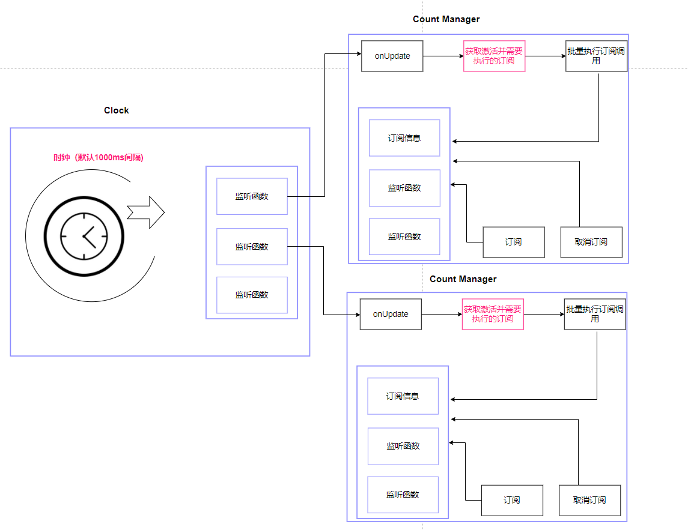

## 起因
直播业务，活动入口显示倒计时，点击活动入口后也显示倒计时。    
最初的倒计时组件倒计时的逻辑是组件内部实现的，各自计算各自的，导致了活动内外的倒计时显示不一致。    

所以把计时逻辑分离，通过key来分组，同样的key具备同样的计时逻辑。

## 安装
```cmd
npm install count-manger
```

## 演示地址
https://xiangwenhu.github.io/count-manager-demos/#/


## 示例

### 正常的倒计时
```typescript
import { countManager } from "..";

const startTime = Date.now();

console.log(`${new Date().toJSON()}: 开始订阅`);

const subScriber = countManager.subScribe(({ value, isOver }) => {
    console.log(`${new Date().toJSON()}: value: ${value}`);

    if(isOver){
        console.log(`${new Date().toJSON()}: cost:`, Date.now() - startTime);
        subScriber.startListening();
    }
}, {
    start: 10 * 1000,
    end: 0 * 1000,
    autoUnsubscribe: true,
    name: "计时哦",
    notifyOnSubscribe: false
}); 

subScriber.startListening();

// 输出：
// 2025-01-26T13:32:46.278Z: 开始订阅
// 2025-01-26T13:32:47.288Z: value: 9000
// 2025-01-26T13:32:48.284Z: value: 8000
// 2025-01-26T13:32:49.280Z: value: 7000
// 2025-01-26T13:32:50.283Z: value: 6000
// 2025-01-26T13:32:51.294Z: value: 5000
// 2025-01-26T13:32:52.290Z: value: 4000
// 2025-01-26T13:32:53.293Z: value: 3000
// 2025-01-26T13:32:54.287Z: value: 2000
// 2025-01-26T13:32:55.290Z: value: 1000
// 2025-01-26T13:32:56.285Z: value: 0
// 2025-01-26T13:32:56.286Z: cost: 10008

```

### 同样的key
```typescript
import { countManager } from "..";

console.log(`subScriber1: ${new Date().toJSON()}: 开始订阅`);
const startTime = Date.now();
const subScriber1 = countManager.subScribe(function ({ value, isOver }) {
    console.log(`subScriber1: ${new Date().toJSON()}: value ${value}`)

    if (isOver) {
        console.log(`${new Date().toJSON()}: cost:`, Date.now() - startTime);
    }
}, {
    start: 5 * 1000,
    key: "down1"
});
subScriber1.startListening();

console.log(`client2: ${new Date().toJSON()}: 开始订阅`);
setTimeout(() => {
    let subScriber2 = countManager.subScribe(({ value, isOver }) => {
        console.log(`subScriber2: ${new Date().toJSON()}: value ${value}`)
    }, {
        start: 10 * 1000,
        key: "down1"
    });
}, 800);


// 输出
// subScriber1: 2025-01-26T13:34:07.816Z: 开始订阅
// subScriber1: 2025-01-26T13:34:07.819Z: value 5000
// client2: 2025-01-26T13:34:07.820Z: 开始订阅
// subScriber2: 2025-01-26T13:34:08.631Z: value 5000
// subScriber1: 2025-01-26T13:34:08.836Z: value 4000
// subScriber2: 2025-01-26T13:34:08.837Z: value 4000
// subScriber1: 2025-01-26T13:34:09.826Z: value 3000
// subScriber2: 2025-01-26T13:34:09.827Z: value 3000
// subScriber1: 2025-01-26T13:34:10.823Z: value 2000
// subScriber2: 2025-01-26T13:34:10.823Z: value 2000
// subScriber1: 2025-01-26T13:34:11.834Z: value 1000
// subScriber2: 2025-01-26T13:34:11.835Z: value 1000
// subScriber1: 2025-01-26T13:34:12.829Z: value 0
// 2025-01-26T13:34:12.830Z: cost: 5012
// subScriber2: 2025-01-26T13:34:12.830Z: value 0
```
### 获取订阅信息
```typescript
import { countManager } from "..";

console.log(`subScriber1: ${new Date().toJSON()}: 开始订阅`);
const subScriber1 = countManager.subScribe(function ({ value, isOver }) {
    console.log(`subScriber1: ${new Date().toJSON()}: value ${value}`)
}, {
    start: 5 * 1000,
    name: "5秒",
    key: "1"
});

console.log(`subScriber2: ${new Date().toJSON()}: 开始订阅`);

let subScriber2 = countManager.subScribe(({ value, isOver }) => {
    console.log(`subScriber2: ${new Date().toJSON()}: value ${value}`)
}, {
    start: 10 * 1000,
    name: "10秒"
});

console.log(`subScriber3: ${new Date().toJSON()}: 开始订阅`);

let subScriber3 = countManager.subScribe(({ value, isOver }) => {
    console.log(`subScriber2: ${new Date().toJSON()}: value ${value}`)
}, {
    start: 10 * 1000,
    name: "10秒",
    key: "1"
});


// 输出
// subScriber1: 2025-01-26T13:35:13.309Z: 开始订阅
// subScriber1: 2025-01-26T13:35:13.312Z: value 5000
// subScriber2: 2025-01-26T13:35:13.312Z: 开始订阅
// subScriber2: 2025-01-26T13:35:13.312Z: value 10000
// subScriber3: 2025-01-26T13:35:13.316Z: 开始订阅
// subScriber2: 2025-01-26T13:35:13.316Z: value 5000
// subscribers [
//   {
//     start: 5000,
//     end: 0,
//     step: 1000,
//     value: 5000,
//     nextStepValue: 4000,
//     listeners: [ [Function (anonymous)], [Function (anonymous)] ],
//     autoUnsubscribe: true,
//     key: '1',
//     name: '5秒',
//     isDecrease: true,
//     notifyOnSubscribe: true,
//     enabled: false
//   },
//   {
//     start: 10000,
//     end: 0,
//     step: 1000,
//     value: 10000,
//     nextStepValue: 9000,
//     listeners: [ [Function (anonymous)] ],
//     autoUnsubscribe: true,
//     key: 'uuid-1',
//     name: '10秒',
//     isDecrease: true,
//     notifyOnSubscribe: true,
//     enabled: false
//   }
// ]
```


## 结构图



## 特点
1. CountManager支持多实例，比如常见的验证码计时， 1000ms为间隔。
2. 会根据当前时间和下一次预计时间点，通过setTimeout动态调整执行计划，确保计时尽可能准确。
3. 支持倒计时，也支持正向计时。
4. 支持统计运行中的计时器